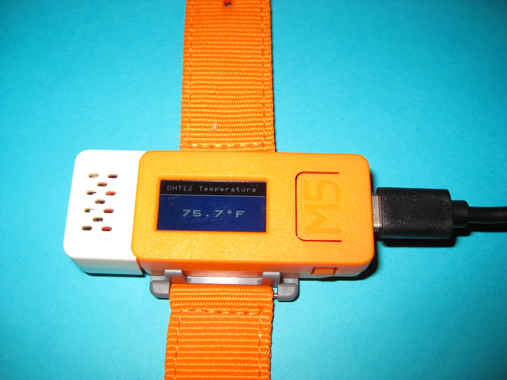
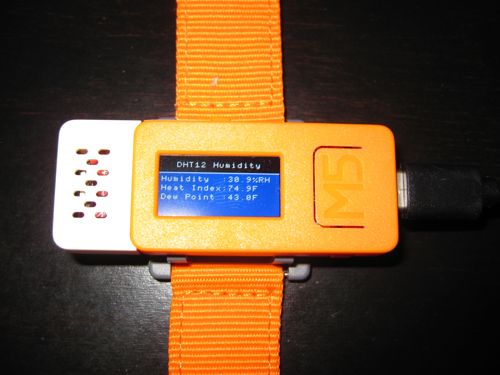
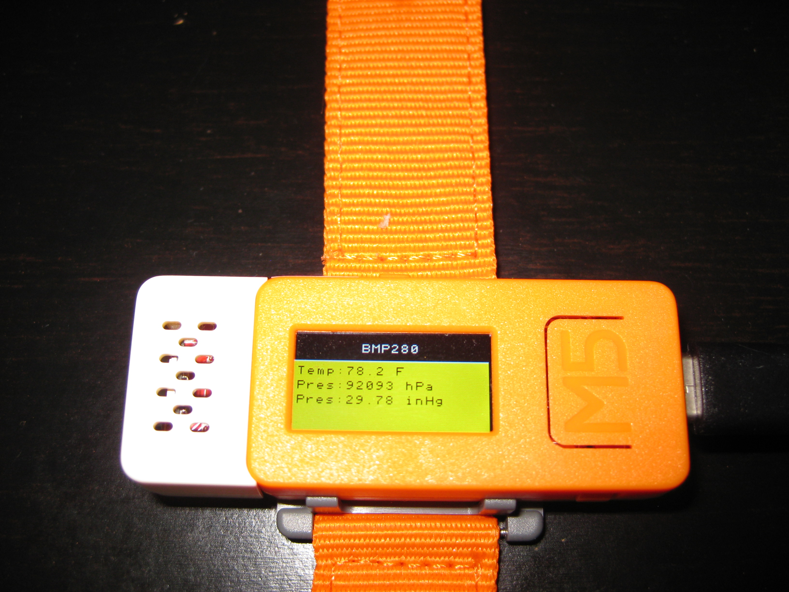
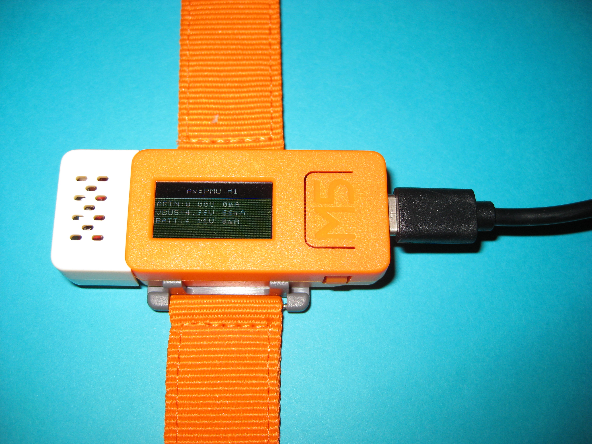
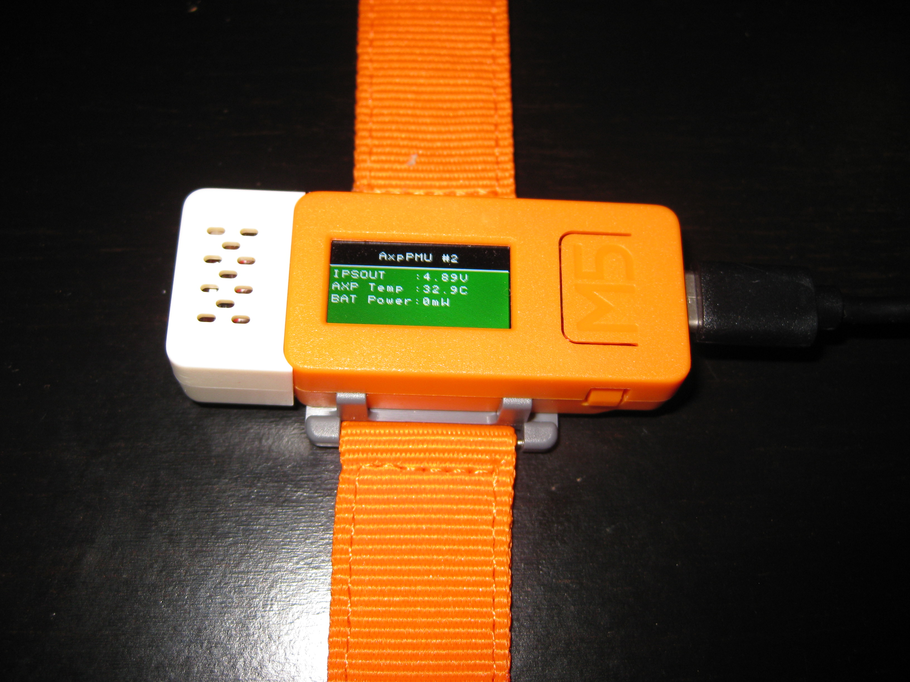
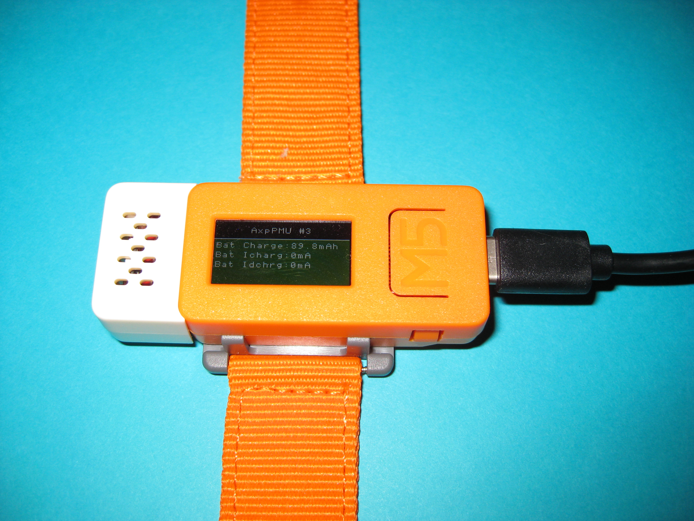

# M5StickColorEnvirSensor
M5Stick with color display, using Smooth C++ library and LittlevGL Graphics library that displays different views of Environment data, AxpPMU data.  The project also sets the RTC BM8563 time and date and sets the alram and date and prints out results.

## Overview
This application shows how to use the Smooth C++ library and the LittlevGL Graphichs library
to display DHT12 values, BMP280 values and AXP192 values in six different views.  The app also programs the internal RTC for
date and time and alarm date and alarm time and prints out results.  The app has two tasks running besides the main Application Task.
The details about the application memory usage, the bin file size and versions of software used on this project are listed at the top of the App.cpp file.

## Views
The following views are displayed by this application.
- DHT12 Temperature View - display temperature in degrees fahrenheit
- DHT12 Humidity View - display the humidity, heat index and dew point
- BMP280 View - display the temperature and pressure in hPA and inHg
- AxpPMU #1 View - display ACIN voltage and current, VBUS voltage and current, BATT voltage and current
- AxpPMU #2 View - display IPSOUT voltage, Axp Temperature, Battery Power (when device is powered on battery only)
- AxpPMU #3 View - display Battery charge in mAh, Battery charging current, Battery discharging current

## A view
A view consists of a title pane, a content pane.  The title pane is at the top of the screen
and the title changes depending upon which view is selected.  The content pane varies depending upon the view 
selected and is positioned below the title pane.

## Buttons
To allow for more content pane area on the display I chose not to implement the menu pane but only use hardware
buttons to change the view. The app uses the two hadrware buttons available on the M5StickC device to select the 
NEXT view or the PREV view. The app performs software debounce on the buttons.  The front button "labeled M5" is 
used to select the previous view when the button is RELEASED.  The side button is used to select the next view 
when the button is PRESSED.

## Tasks
The app has 2 additional tasks running besides the Application Task. 
- HwBtnTask - A task used to debounce hardware buttons.
- LvglTask - A tasks that runs LittlevGL.  All files in gui folder are running under this task.

## RTC - BM8563
The app programs the RTC to a date and time of Tuesday, Februray 25, 2020 1:08 pm. The alarm day, day of week and time is programmed to 
Tuesday, 25th, 1:12pm and to trigger the alarm on every 12 minutes past any hour, any day and any weekday.  so alarm will trigger
at 1:12pm, 2:12pm 3:12pm on any day or weekday.   The app keeps count of the number of times the alarm has triggered.

## Power Management - Axp192
The app initailize the AXP192 with the appropraite settings to power the RTC, LCD and LCD brightness and battery charger and backup battery (RTC) 
charger.  The app then displays all the measurements from the AXP192.

## Envir Hat - DHT12, BMP280
The app displays environmental measurements obtained from the sensors inside the Envir Hat that is plugged into the M5StickC.  The app performs
additional calculation using humidity and temperture to determine heat index and dew point.  The app performa additional calculations using pressure 
and temperature and altitude to determine sea level pressure.  The temperature reading seems 5 degrress higher than it should be.

## Pictures of the various views
Some of of colors are washed out on some pictures but you get an idea of what the displays should look like.  

The Temperature View

The Humidity View

The BMP280 View

The AxpPMU #1 View

The AxpPMU #2 View

The AxpPMU #3 View

